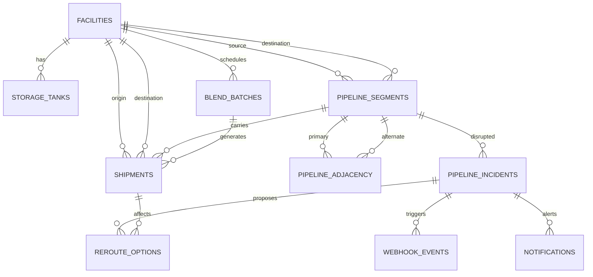

# energy-Logix Database Schema

PostgreSQL schema for volumetric mass-balance integrity in heavy crude diluent blending and pipeline logistics.

## Entity Relationship Overview



## Tables

| Table | Purpose |
|-------|---------|
| `facilities` | Production assets, hubs, upgraders, refineries, terminals |
| `storage_tanks` | Local terminal tanks for disruption diversion |
| `pipeline_segments` | Directed edges in the topology graph |
| `pipeline_adjacency` | Alternate reroute paths between segments |
| `blend_batches` | Scheduled bitumen/diluent blend operations |
| `shipments` | Active volume movements on the network |
| `pipeline_incidents` | Simulated or real disruption events |
| `reroute_options` | Automated reroute/storage diversion recommendations |
| `notifications` | In-app command center alerts |
| `webhook_events` | Outbound payloads for Commercial Trading Desk |
| `inventory_ledger` | Immutable audit trail for mass balance |

## Volumetric Integrity Constraints

### Facility Inventory
```sql
CHECK (bitumen_bbls >= 0)
CHECK (diluent_bbls >= 0)
CHECK (total_storage_capacity_bbls > 0)
CHECK ((bitumen_bbls + diluent_bbls) <= total_storage_capacity_bbls)
```

### Storage Tanks
```sql
CHECK (max_capacity_bbls > 0)
CHECK (current_volume_bbls >= 0)
CHECK (current_volume_bbls <= max_capacity_bbls)
```

### Pipeline Capacity
```sql
CHECK (max_daily_capacity_bbls > 0)
CHECK (current_flow_bbls_per_day >= 0)
CHECK (current_flow_bbls_per_day <= max_daily_capacity_bbls)
```

### Blend Formula Trigger
On `blend_batches` INSERT/UPDATE, a trigger validates:

```
Required Diluent = (target_ratio × bitumen_volume) / (1 - target_ratio)
total_blended_volume = bitumen_volume + required_diluent
```

## Topology (Seed Data)

```
Foster Creek ──────┐
Christina Lake ────┼──► Lloyd Hub ──► Lloydminster Upgrader
Sunrise ───────────┘         │
                             ├──► Hardisty Terminal ──► Eastern Refinery
Christina Lake ──────────────┘    (alternate route)
```

## Target Ratio Range

Blend batches enforce `target_ratio` between 0 and 1 (exclusive). Application layer validates 0.20–0.30 (20%–30% diluent fraction).

## Status Color Mapping (UI)

| Status | Color | Pipeline | Inventory |
|--------|-------|----------|-----------|
| Optimal | Green | ACTIVE, &lt;75% util | &lt;75% storage |
| Restricted | Orange | RESTRICTED or 75–90% util | 75–90% storage |
| Disrupted | Red | SHUTDOWN or &gt;90% util | &gt;90% or depletion warning |
